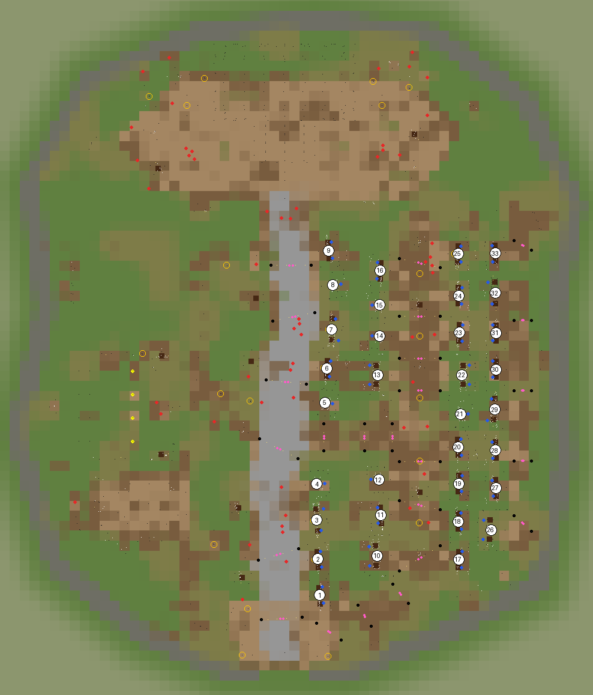

# Stall directory

Generated by the generator from `fair.config.json` on every build; do not edit by hand.
Each stall's keeper carries the stall's name in game. In the console, `player.moveto` a
stall's marker to go to it. Change a stall's goods in `fairWorld.market.stallKits`
(by theme) and `fairWorld.market.vignettes`. The numbers match the map in
`docs/images/stalls_map.png` (drawn from the plugin; redraw it after a layout change).

| # | Stall | Theme | Lane | At (x, y) | Shell | Counter goods | Beside / behind | Sign |
| --- | --- | --- | --- | --- | --- | --- | --- | --- |
| 1 | Fruit & Produce Stall | `produce` | Avenue right | 2497, -1023 | canvas_pair | veg_cabbages, veg_apples, veg_basket, veg_gourds | produce_spill, apple_crates, crates_stack, barrels_pair, sacks, stock_pile | sign_trader |
| 2 | Hot Pie Stall | `pies` | Avenue right | 2476, -561 | canvas_pair | pies, pies_plated | small_brazier, crates_stack, barrels_pair, sacks, stock_pile | sign_general |
| 3 | Mead & Ale Stall | `mead` | Avenue right | 2459, -59 | canvas_wide | mead_bottles, tankards, wine_bottles, drinks_crate | mead_stack, barrel_table, crates_stack, barrels_pair, sacks, stock_pile | sign_mead |
| 4 | Cheese & Dairy Stall | `cheese` | Avenue right | 2461, 402 | whiterun_stand | cheese_board, dairy, cheese_stack | barrels_pair, sacks, crates_stack, stock_pile | sign_general |
| 5 | Bakery Stall | `bakery` | Avenue right | 2563, 1445 | whiterun_stand | bread_board, bread_basket, pastries | sacks_grain, firewood, crates_stack, barrels_pair, sacks, stock_pile | sign_wrgeneral |
| 6 | Roast Meat Stall | `roast` | Avenue right | 2592, 1883 | canvas_pair | meats, meats_board | spit_roast, firewood, crates_stack, barrels_pair, sacks, stock_pile | sign_hunter |
| 7 | Spiced / Hot Drinks Stall | `hotdrinks` | Avenue right | 2649, 2380 | canvas_wide | hot_drinks, spice_cups | small_brazier, barrel_table, crates_stack, barrels_pair, sacks, stock_pile | sign_mead |
| 8 | Honey & Beekeeping Stall | `honey` | Avenue right | 2669, 2951 | whiterun_stand | honey_jars, honeycomb, candles | sacks, crates_stack, barrels_pair, stock_pile | sign_honey |
| 9 | Spice & Imported Foods Trader | `spices` | Avenue right | 2613, 3392 | canvas_pair | spices, spice_sacks | sacks_grain, herb_baskets, crates_stack, barrels_pair, sacks, stock_pile | sign_aromatics |
| 10 | Iron & Steel Smith | `smith` | EastLane left | 3235, -517 | grand_double | swords, axes, smith_bits, helmets | weapon_barrel, smith_crate, crates_stack, barrels_pair, sacks, stock_pile | sign_smith |
| 11 | Hunter & Leatherworker | `hunter` | EastLane left | 3281, 4 | canvas_pair | hunter_hides, leather, hunter_arrows | pelt_rack, pelt_pile, crates_stack, barrels_pair, sacks, stock_pile | sign_hunter |
| 12 | Elven Goods Trader | `elven` | EastLane left | 3255, 457 | whiterun_stand | elven, silver, gems | crates_stack, stock_pile | sign_curios |
| 13 | Imperial Armourer | `imperial` | EastLane left | 3240, 1800 | grand_double | imperial_goods, swords, helmets, imperial_horn | weapon_barrel, smith_crate, crates_stack, barrels_pair, sacks, stock_pile | - |
| 14 | Dwemer Curios Stall | `dwemer` | EastLane left | 3267, 2300 | whiterun_stand | dwemer, dwemer2 | dwemer_ground, crates_stack, barrels_pair, sacks, stock_pile | sign_pawn |
| 15 | Mage Supplies Stall | `mage` | EastLane left | 3267, 2695 | whiterun_stand | staves, gems, candles, books | candle_stand, crates_stack, barrels_pair, sacks, stock_pile | sign_alchemy |
| 16 | Alchemy Stall | `alchemy` | EastLane left | 3276, 3136 | canvas_pair | potions, alchemy_ingredients, flowers | herb_baskets, crates_stack, barrels_pair, sacks, stock_pile | sign_alchemy |
| 17 | Books & Scrolls Stall | `books` | EastLane right | 4279, -562 | canvas_pair | books, scrolls, writing | book_crate, candle_stand, crates_stack, barrels_pair, sacks, stock_pile | sign_curios |
| 18 | Jeweller | `jeweller` | EastLane right | 4270, -79 | canvas_pair | jewellery, gems_cut, ingots_gold | crates_stack, stock_pile | sign_pawn |
| 19 | General Trinkets & Curios | `curios` | EastLane right | 4280, 405 | canvas_pair | trinkets, silver | pottery_ground, crates_stack, barrels_pair, sacks, stock_pile | sign_curios |
| 20 | Fur Trader | `furs` | EastLane right | 4273, 876 | canvas_pair | furs, hunter_hides | pelt_pile, rug_ground, crates_stack, barrels_pair, sacks, stock_pile | sign_hunter |
| 21 | Herbalist / Apothecary | `herbalist` | EastLane right | 4303, 1298 | whiterun_stand | flowers, alchemy_ingredients | flower_baskets, herb_baskets, crates_stack, barrels_pair, sacks, stock_pile | sign_aromatics |
| 22 | Stormcloak / Nord Armourer | `stormcloak` | EastLane right | 4320, 1800 | grand_double | stormcloak_goods, axes, stormcloak_cuirass, furs | pelt_rack, weapon_barrel, crates_stack, barrels_pair, sacks, stock_pile | - |
| 23 | Fishmonger / Smoked Fish | `fishmonger` | EastLane right | 4285, 2340 | canvas_pair | fish, fish_salted | sacks, barrels_pair, crates_stack, stock_pile | sign_fish |
| 24 | Bowyer & Fletcher | `fletcher` | EastLane right | 4278, 2811 | canvas_pair | arrow_bundle, bows | arrow_barrel, crates_stack, barrels_pair, sacks, stock_pile | sign_fletcher |
| 25 | Sweetroll Stall | `sweetroll` | EastLane right | 4270, 3350 | canvas_pair | sweetroll_platter, sweetroll_plate, sweetroll_row | sacks_grain, barrel_table, crates_stack, barrels_pair, sacks, stock_pile | sign_honey |
| 26 | Clothing & Fine Fabrics | `clothing` | EastWallWalk left | 4696, -186 | grand_double | linens, rug_rolls | rug_ground, rug_ground2, crates_stack, barrels_pair, sacks, stock_pile | sign_clothes |
| 27 | Woodworker / Carpenter | `woodworker` | EastWallWalk left | 4755, 351 | canvas_pair | carved, carved_tools | timber, tools_rack, crates_stack, barrels_pair, sacks, stock_pile | sign_trader |
| 28 | Pottery & Household Goods | `pottery` | EastWallWalk left | 4749, 834 | canvas_pair | pottery, pottery2, household | pottery_ground, buckets, crates_stack, barrels_pair, sacks, stock_pile | sign_general |
| 29 | Festival Toys & Gifts | `toys` | EastWallWalk left | 4745, 1355 | canvas_wide | toys, gifts | crates_stack, barrels_pair, sacks, stock_pile | sign_general |
| 30 | Fortune Teller / Mystic Curios | `fortune` | EastWallWalk left | 4755, 1869 | canvas_pair | mystic, mystic_candles, gems | candle_stand, crates_stack, barrels_pair, sacks, stock_pile | sign_curios |
| 31 | Rare Goods / Travelling Merchant | `rare` | EastWallWalk left | 4755, 2336 | canvas_pair | antiquities, antiquities2 | dwemer_ground, stock_pile, crates_stack, barrels_pair, sacks | sign_pawn |
| 32 | Candle & Tallow Maker | `candles` | EastWallWalk left | 4748, 2849 | canvas_wide | candles, tallow | candle_stand, crates_stack, barrels_pair, sacks, stock_pile | sign_general |
| 33 | Bard & Instrument Merchant | `bard` | EastWallWalk left | 4750, 3357 | canvas_pair | instruments, songbooks, lute_stand | crates_stack, barrels_pair, sacks, stock_pile | sign_trader |

## Kits ready but not placed

These trades have kits and keeper names but no stall yet (the site fits 33):

- Miner & Prospector (`miner`)
- Saddler / Horse Tack Merchant (`saddler`)
- Religious Charms & Amulets (`religious`)
- Cartographer / Traveller's Supplies (`cartographer`)
- Festival Decorations & Ribbons (`decorations`)
- Provincial Imports Trader (`imports`)

## Markers

| # | Stall | Marker (`player.moveto`) |
| --- | --- | --- |
| 1 | Fruit & Produce Stall | `SkyrimFairStallProduce01` |
| 2 | Hot Pie Stall | `SkyrimFairStallPies01` |
| 3 | Mead & Ale Stall | `SkyrimFairStallMead01` |
| 4 | Cheese & Dairy Stall | `SkyrimFairStallCheese01` |
| 5 | Bakery Stall | `SkyrimFairStallBakery01` |
| 6 | Roast Meat Stall | `SkyrimFairStallRoast01` |
| 7 | Spiced / Hot Drinks Stall | `SkyrimFairStallHotdrinks01` |
| 8 | Honey & Beekeeping Stall | `SkyrimFairStallHoney01` |
| 9 | Spice & Imported Foods Trader | `SkyrimFairStallSpices01` |
| 10 | Iron & Steel Smith | `SkyrimFairStallSmith01` |
| 11 | Hunter & Leatherworker | `SkyrimFairStallHunter01` |
| 12 | Elven Goods Trader | `SkyrimFairStallElven01` |
| 13 | Imperial Armourer | `SkyrimFairStallImperial01` |
| 14 | Dwemer Curios Stall | `SkyrimFairStallDwemer01` |
| 15 | Mage Supplies Stall | `SkyrimFairStallMage01` |
| 16 | Alchemy Stall | `SkyrimFairStallAlchemy01` |
| 17 | Books & Scrolls Stall | `SkyrimFairStallBooks01` |
| 18 | Jeweller | `SkyrimFairStallJeweller01` |
| 19 | General Trinkets & Curios | `SkyrimFairStallCurios01` |
| 20 | Fur Trader | `SkyrimFairStallFurs01` |
| 21 | Herbalist / Apothecary | `SkyrimFairStallHerbalist01` |
| 22 | Stormcloak / Nord Armourer | `SkyrimFairStallStormcloak01` |
| 23 | Fishmonger / Smoked Fish | `SkyrimFairStallFishmonger01` |
| 24 | Bowyer & Fletcher | `SkyrimFairStallFletcher01` |
| 25 | Sweetroll Stall | `SkyrimFairStallSweetroll01` |
| 26 | Clothing & Fine Fabrics | `SkyrimFairStallClothing01` |
| 27 | Woodworker / Carpenter | `SkyrimFairStallWoodworker01` |
| 28 | Pottery & Household Goods | `SkyrimFairStallPottery01` |
| 29 | Festival Toys & Gifts | `SkyrimFairStallToys01` |
| 30 | Fortune Teller / Mystic Curios | `SkyrimFairStallFortune01` |
| 31 | Rare Goods / Travelling Merchant | `SkyrimFairStallRare01` |
| 32 | Candle & Tallow Maker | `SkyrimFairStallCandles01` |
| 33 | Bard & Instrument Merchant | `SkyrimFairStallBard01` |
